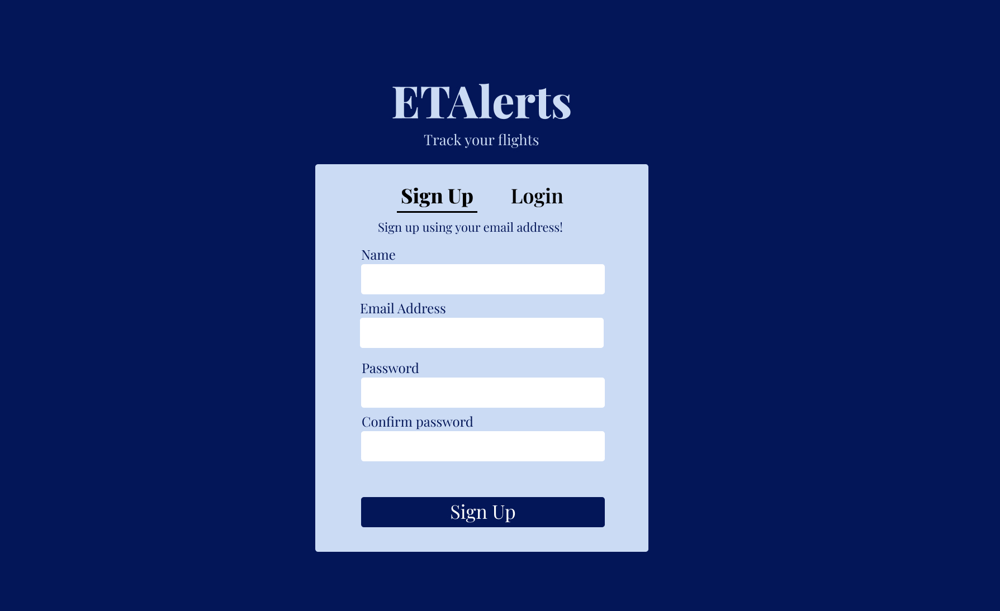
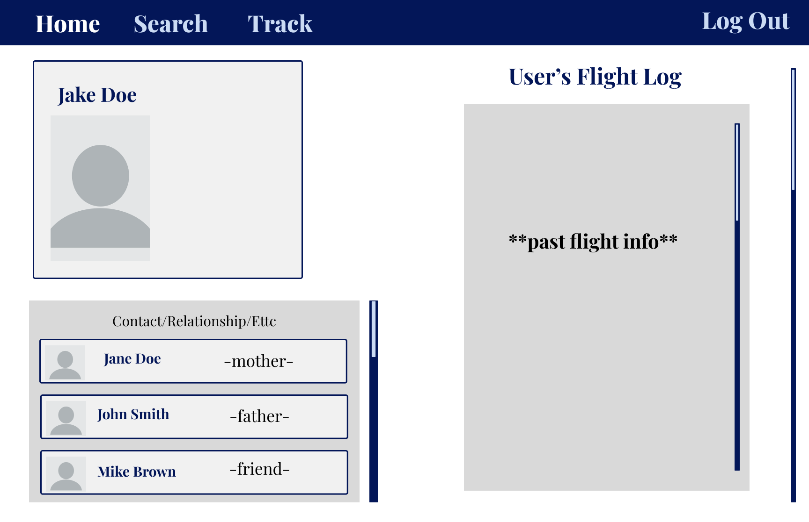
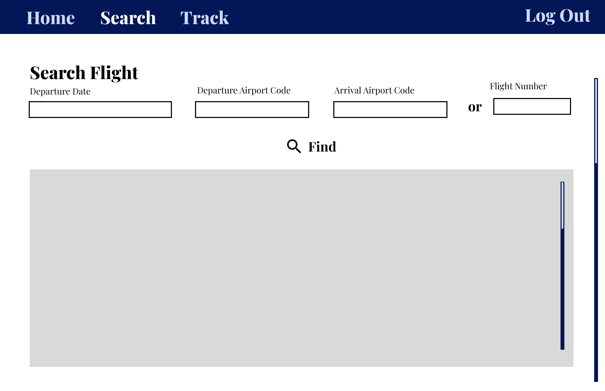
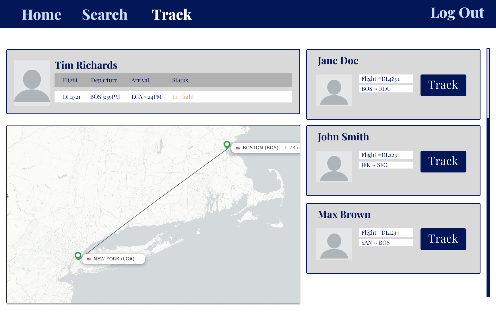
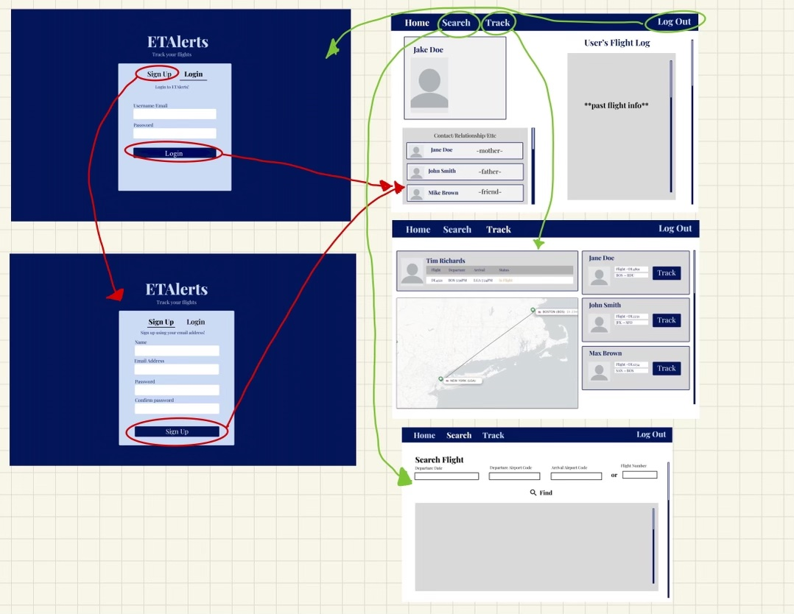

# UI Design

## Wireframe

For our wireframe, we will be using Figma to illustrate our UI design.

### Login/Sign-up
On this page, the user will be met with a series of text boxes and the option to either sign-up or log-in to the site. For the sign-up option, the user will need to fill out text boxes that correlate to 'name', 'email address', 'password', and 'confirm password' fields. For the login option, the user simply has to fill out 'username/email' and 'password' text fields. 

 

### Home
At the home page, or Dashboard page, the user will be able to navigate to the other pages such as the 'Search Flights' and the 'Track Flight' pages. The dashboard will have a navigation bar at the top to access these pages. In addition to navigation, a list of the user's contacts will appear on the left side of the screen. This will default include the user's profile as well. On the right side of the screen, the user's past flight logs will be displayed.

### Search Flights
On this page, the user will be able to search for flights depending on the departure time, departure date, and the arrival airport code. The user can also just input the flight number instead to search for a specific flight. A flight/list of flights will then be available based on the user's input in the box below. With variety of options of flights, the feature will display no flights found if there could not have been any flights that matched and prompt the user to type in a different option. 

### Track Flights 
On this page, the user will be able to select a flight that one of their contacts is on that they want to track. There is a scroll option on the side to allow the user to select other contacts to track as well. Once selected, a map will appear with an image of the flight travel plan. 

## Stories

### Story

First we have the sign up page. The user can sign up here or if they already have an account, they can click on "Login" to enter the Login page. 

Once the user signs up or logs in, the user will land on the "Home" page. The "Home" page shows the list of contacts of the user and their flight log which lists past flights that they have tracked.

The navigation bar lists out the "Home", "Search", and "Track" page. The user can navigate from one page to another using the navigation bar. 

In the "Search" page, the user can search for new flights by clicking in the textboxes listed (e.g. "Departure Date", "Departure Airport Code", "Arrival Airport Code", "Flight Number". Then the user can click on the "Find" button in order to complete their search.

In the "Track" page, the user can see all of the flights that their contacts are on. The track page features the selected contact user's flight information including the flight number, depature and arrival location/time, and status.

## HTML & CSS Mockup

See [milestone.md](milestone1.md) for screeshots of the HTML and CSS mockup.
## References

- [Bootstrap Starter](https://getbootstrap.com/docs/5.3/getting-started/introduction/)
